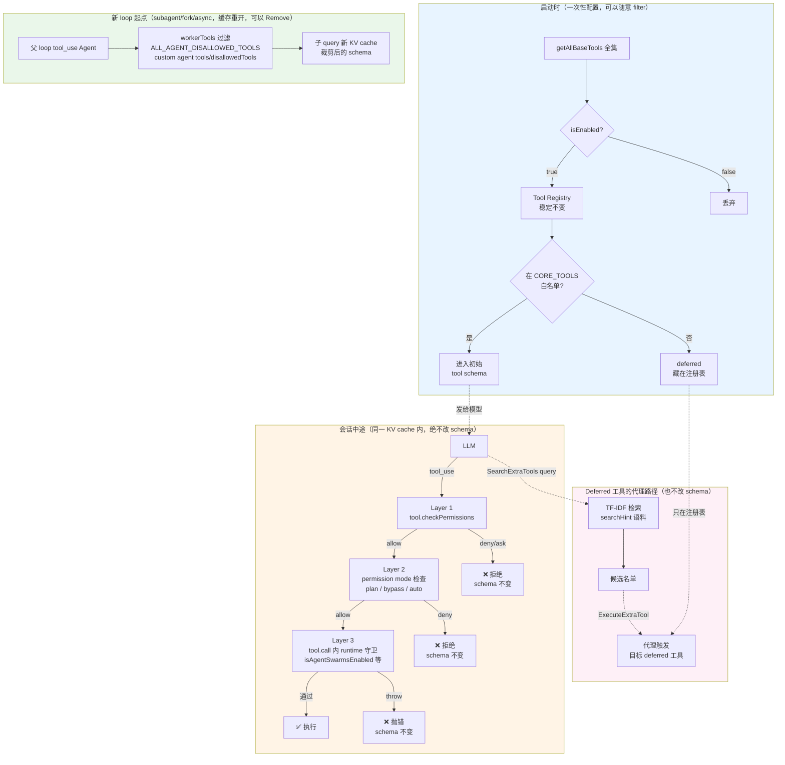
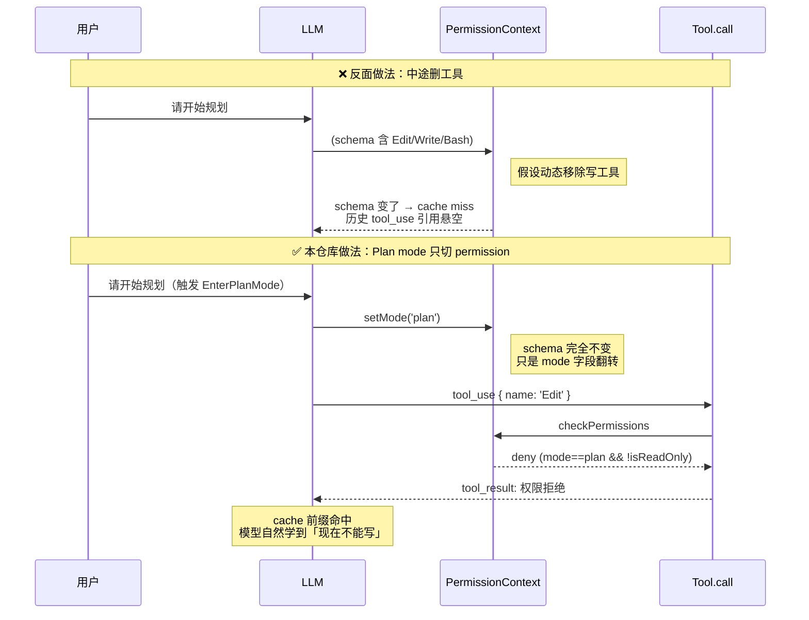
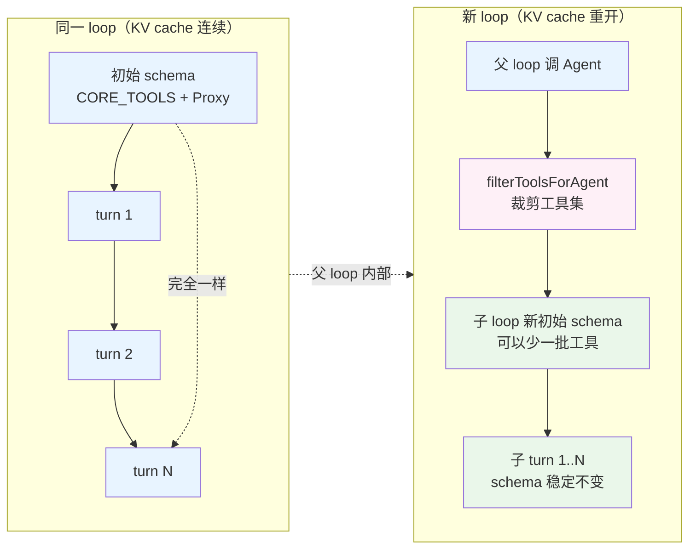

# Mask, Don't Remove —— 本仓库如何避免中途改 tool schema

> 参考：Manus [Context Engineering for AI Agents: Lessons from Building Manus](https://manus.im/blog/Context-Engineering-for-AI-Agents-Lessons-from-Building-Manus)
>
> 原则：动态增/删工具会破坏 KV cache 前缀，还会让历史 `tool_use` 引用变悬空。解法是保持 tool schema 稳定，靠 logit mask / 权限层去禁用某些工具。

本仓库虽然不直接操作 logit（那需要 provider 支持 constrained decoding），但**在权限层、路由层、缓存层用了等价思路**。下面按证据梳理。

## TL;DR

按「是否处于同一 KV cache 内」分两档：

| 场景 | 策略 | 手段 |
|------|------|------|
| 会话中途（同一 KV cache 内） | **Mask** —— 保 schema 稳定 | 权限层动态拒绝 + 代理工具（SearchExtraTools/ExecuteExtraTool） |
| 新 loop 启动（subagent / fork / async agent） | **可以 Remove** —— 反正开新缓存 | `workerTools` 过滤、`ALL_AGENT_DISALLOWED_TOOLS`、custom agent 的 `tools`/`disallowedTools` |

关键区别：Manus 说的「不要在会话中途改 schema」——只要不是中途，remove 是安全的。

## 全景图



---

## 一、Mask 的证据

### 1. Plan mode —— 切「权限模式」而不切「工具集」
`docs/safety/plan-mode.mdx` + `src/utils/permissions/permissions.ts:1291`

进入 plan 时**不改 tool schema**，只切 `toolPermissionContext.mode = 'plan'`。之后 Bash/Edit/Write 仍出现在模型看到的工具列表里，但 permission 层在 `checkPermissions` 阶段把写工具返回 `ask/deny`，或让 `isReadOnly()==false` 的调用直接被拒。

- 模型看到的 tool schema 前缀完全不变 → cache 命中
- 历史 `tool_use` / `tool_result` 引用依然有效
- 「屏蔽」由权限层实现，正是 Mask 语义

### 2. Deferred tools —— 用「代理工具」替代动态注册
`packages/builtin-tools/src/tools/ExecuteTool/` + `SearchExtraToolsTool/`

如果 deferred 工具真的动态加进 schema，会破坏 cache。设计者反而让 `SearchExtraTools` + `ExecuteExtraTool` 两个**代理工具永久驻留**在 `CORE_TOOLS` 白名单里，deferred 工具通过：

```
模型 → SearchExtraTools(query)  → 得到候选名单
      → ExecuteExtraTool(name, params) → 代理触发目标工具
```

schema 从头到尾没变过，deferred 工具的注册表启动时就固定；相当于「工具全在，只是从模型视角被 mask 起来了」。设计意图与 Manus 完全一致——**避免中途改 tool schema**。

参考 `.shousui/notes/tool-registration-and-deferred-tools.md`。

### 3. AgentTool 的 runtime 守卫
工具**不下架**，只在 runtime 里拒绝相应输入：

- `AgentTool.tsx:351` — teammate 分支：
  ```ts
  if (team_name && !isAgentSwarmsEnabled()) {
    throw new Error('Agent Teams is not yet available on your plan.')
  }
  ```
- `AgentTool.tsx:429` — fork 递归守卫：
  ```ts
  throw new Error('Fork is not available inside a forked worker...')
  ```

fork 子里 AgentTool 仍在工具列表——保持 cache 前缀一致——只是走到 `call()` 抛错。这是 Manus 原文里「不能删工具，但可以让模型无法选它」的另一种表达。

### 4. TeamCreateTool / 其他 feature-gated 工具
详见 `.shousui/notes/tool-registration-and-deferred-tools.md`。三层机制：

- `getAllBaseTools()` 是全集，工具**默认长驻**
- 是否给模型看由 `CORE_TOOLS` 白名单**静态**决定，不因运行时状态变化
- 是否允许执行由 `call()` 内的 runtime 判断（如 `isAgentSwarmsEnabled()`）

结果：agent teams 开关 flip 时，schema 不变——mask 而已。

### 5. Prompt cache break detection
`src/services/api/promptCacheBreakDetection.ts` + `feature('PROMPT_CACHE_BREAK_DETECTION')`

代码专门有一套机制**监测 cache prefix 是否被打断**，命中就写 diff 到临时目录并告警。这是「我们真的很在乎缓存不被破坏」的直接证据——只有把缓存当一等公民时才会做这种诊断工具。

`src/context.ts:22` 更极端：cache-break nonce 需要提供 reason 才能触发，避免不必要的 cache 失效。

### 6. AskUserQuestion 引导决策
`AgentTool` 等工具的 prompt 文本会引导模型「不确定就调 AskUserQuestion 澄清」而不是让开发者动态修改工具——同样是把决策留给模型选/不选（mask 语义），不改 schema。

### Mask 场景时序对比



---

## 二、Remove 的反例（并不违背原则）

本仓库在**新起一段独立缓存**的场景里会主动做工具过滤，因为这时 cache 反正是新开的，没有破坏问题：

| 场景 | 代码位置 | 为什么可以移除 |
|------|----------|----------------|
| Subagent 的 `workerTools` | `AgentTool.tsx:782` | 子 agent 是新的 `query()` loop，重新算 cache |
| Fork 子过滤 `LocalMemoryRecall` / `VaultHttpFetch` | `src/utils/agentToolFilter.ts` `filterParentToolsForFork` | 虽继承父 conversation，但父工具的 tool_use 已完成、不会再引用；fork 用 `useExactTools` 保证工具序列化一致——过滤是白名单裁剪，不是运行时增减 |
| `ALL_AGENT_DISALLOWED_TOOLS` | `src/constants/tools.ts:44` | 同上，subagent 启动时一次性过滤 |
| Async agent 只允许 `ASYNC_AGENT_ALLOWED_TOOLS` | `src/constants/tools.ts:71` | 后台 agent 独立进程/独立缓存 |
| 用户自定义 agent 的 `tools` / `disallowedTools` | `docs/extensibility/custom-agents.mdx` | Subagent 启动时算一次 |

关键区别：**这些过滤都是「新 loop 启动时的初始配置」，不是「进行中的 loop 里动态改」**。

### Deferred 工具 vs 新 loop 过滤对比



要点：
- 同一 loop 内 schema 是**天条**，任何「屏蔽」都发生在权限层
- 跨 loop 边界时才允许改工具集，且改完之后子 loop 内 schema 又变成天条

---

## 三、和 Manus 原文的对应关系

| Manus 原文提到的问题 | 本仓库的处理 |
|----------------------|--------------|
| 中途改 schema 破坏 KV cache 前缀 | Plan mode 只切 permission context，不动 schema |
| 中途改 schema 让历史 tool_use 悬空 | Deferred 工具用代理（SearchExtraTools/ExecuteExtraTool）而非动态注册 |
| 应该「mask logits」而不是删工具 | `checkPermissions` 层做 mask，`call()` runtime 守卫做兜底 |
| 提供稳定的 prefix 以最大化 cache 命中 | `CORE_TOOLS` 白名单静态、`getAllBaseTools()` 顺序稳定、cache break 监测告警 |

## 四、一句话总结

本仓库没有原生 logit mask 能力（provider 层不一定支持），但通过**权限层 mask + 代理工具 + 严格区分「同 loop 内」vs「新 loop 起点」** 这三件事，把 Manus 「Mask, Don't Remove」原则落到了可实现的位置。

## 相关笔记

- `.shousui/notes/subagent-spawn-mechanism.md` — AgentTool 完整调用链
- `.shousui/notes/tool-registration-and-deferred-tools.md` — 工具三层机制（存在 / 可见 / 可调）
- `.shousui/notes/tool-error-as-feedback.md` — 权限拒绝作为反馈信号（同样是不改 schema 的思路）
