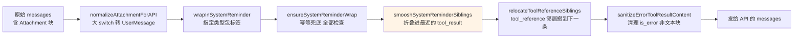

# 每轮 Turn 究竟塞了什么给模型

> 用户按下回车，只是入口。系统会在同一 turn 里**追加一堆内容**到 `messages[]` 和 system prompt 里。这份文档把所有注入路径梳理清楚。
>
> 姊妹篇：
> - `.shousui/notes/system-reminder-architecture.md` — `<system-reminder>` 单一标签的深度解析
> - `.shousui/notes/tools-mechanism-overview.md` — 工具三层（存在/可见/可调）机制
> - `.shousui/notes/mask-dont-remove.md` — 「保 schema 稳定」原则

## TL;DR

一次 turn 到达模型时，大概是：

```
你的原文（1 条）
+ ~45 种可能的 Attachment（触发时才注入）
+ <local-command-stdout>（斜杠命令输出）
+ metaMessages（模式切换等）
+ Hook 输出（UserPromptSubmit / PreToolUse / PostToolUse）
+ <available-deferred-tools> 通告
+ File @-mention / IDE 桥接 / 图片粘贴附件
+ Recovery / autocompact / synthetic messages
= 10+ 条 messages（视触发条件）

外加系统提示层重算：
+ base prompt
+ systemContext（git status / date / timezone）
+ CLAUDE.md（独立高权重块）
+ 各种 addendum（advisor / chrome tools 等）
```

## 全景图

```mermaid
flowchart TB
    U[你按回车<br/>原始输入] --> P[processUserInput]

    subgraph MESSAGES["每轮追加到 messages 数组（都是 isMeta:true）"]
        direction TB
        P --> C1["1. 本地命令输出<br/><local-command-stdout><br/><local-command-stderr>"]
        P --> C2["2. Meta messages<br/>/proactive /coordinator /brief<br/>模式切换文本"]
        P --> C3["3. Hook 输出<br/>UserPromptSubmit / PreToolUse / PostToolUse<br/>~8 种 hook_* attachment"]
        P --> C4["4. Attachment 系统<br/>getAttachmentMessages<br/>~45 种类型"]
        P --> C5["5. Deferred 工具通告<br/><available-deferred-tools>"]
        P --> C6["6. File @-mention<br/>@path 展开为文件内容附件"]
        P --> C7["7. IDE 桥接上下文<br/>selection / opened files / diagnostics"]
        P --> C8["8. 粘贴 / 拖拽<br/>image / PDF / bash 输出块"]
        P --> C9["9. Recovery / synthetic<br/>断线恢复 / autocompact / 自动重试"]
    end

    subgraph SYSPROMPT["系统提示每轮重算（不进 messages）"]
        direction TB
        S1[base prompt<br/>getCLISyspromptPrefix]
        S2[systemContext<br/>git status / date / timezone]
        S3[CLAUDE.md<br/>独立高权重块]
        S4[dynamic addendum<br/>advisor / chrome 等]
    end

    subgraph NORM["最后一道归一化 normalizeMessagesForAPI"]
        direction TB
        N1[normalizeAttachmentForAPI<br/>Attachment → UserMessage 大 switch]
        N2[wrapInSystemReminder<br/>某些 type 包 <system-reminder>]
        N3[ensureSystemReminderWrap<br/>幂等兜底]
        N4[smooshSystemReminderSiblings<br/>折叠进 tool_result]
        N5[relocateToolReferenceSiblings<br/>tool_reference 邻居搬迁]
        N6[sanitizeErrorToolResultContent<br/>清理 is_error tool_result]
    end

    subgraph TOOL_TAIL["工具结果尾部拼接（tool_result 内部）"]
        direction TB
        T1[FileReadTool<br/>空文件警告 / CYBER_RISK]
        T2[BashTool<br/>pwd 变化 / 截断提示]
        T3[ExitPlanMode<br/>审批状态]
        T4[所有工具<br/>truncated / max size 警告]
    end

    MESSAGES --> NORM
    NORM --> API[发给 LLM]
    SYSPROMPT --> API
    TOOL_TAIL -.已在 tool_result 内.-> API

    style MESSAGES fill:#fff4e6
    style SYSPROMPT fill:#e8f4ff
    style NORM fill:#fef0f7
    style TOOL_TAIL fill:#eaf7ea
```



---

## 一、走 Attachment 系统（~45 种类型）

`src/utils/attachments.ts` 定义。所有 attachment 经 `getAttachmentMessages` 并发采集，`maybe(label, fn)` 包装做容错 + feature gate + 空值过滤。多数会在 `normalizeAttachmentForAPI` 里被 `wrapInSystemReminder` 包起来，少数带独立标签或不包。

### 1.1 文件 / 代码
| type | 触发场景 |
|------|----------|
| `file` | `@path` mention 或拖入文件 |
| `already_read_file` | 之前读过的文件，追新内容或行数变化 |
| `edited_text_file` | 会话中被 Edit/Write 修改过的文件（提示模型状态变了） |
| `edited_image_file` | 图片文件被修改 |
| `new_file` | 会话中新建的文件 |
| `new_directory` | 会话中新建的目录 |
| `directory` | 目录列表 |
| `pdf_reference` | PDF 文件引用 |
| `compact_file_reference` | 大文件的紧凑引用 |
| `plan_file_reference` | plan 文件引用 |

### 1.2 IDE 桥接
| type | 触发场景 |
|------|----------|
| `opened_file_in_ide` | IDE 当前打开的文件 |
| `selected_lines_in_ide` | 你在 IDE 里选中的代码段 |
| `diagnostics` | LSP 错误/警告列表 |

### 1.3 Hook 输出（8 种）
`docs/extensibility/hooks.mdx` 详解。hook 的 `additionalContext` 通过 `hook_additional_context` 注入。

| type | 触发场景 |
|------|----------|
| `hook_blocking_error` | PreToolUse hook 阻塞了工具 |
| `hook_stopped_continuation` | Stop hook 触发 |
| `hook_additional_context` | UserPromptSubmit hook 附加内容 |
| `hook_permission_decision` | Hook 决定的权限结果 |
| `hook_system_message` | Hook 系统消息 |
| `hook_success` / `hook_non_blocking_error` / `hook_error_during_execution` / `hook_cancelled` | 各种 hook 状态 |
| `async_hook_response` | 异步 hook 响应 |

### 1.4 Skill / Agent / Tool 发现
| type | 触发场景 |
|------|----------|
| `dynamic_skill` | Skill 动态激活 |
| `skill_listing` | Skill 列表通告 |
| `skill_discovery` | Skill prefetch 结果 |
| `invoked_skills` | 已调用的 skill 记录 |
| `tool_discovery` | SearchExtraTools prefetch 结果 |
| `deferred_tools_delta` | Delta 通告 deferred 工具（`<available-deferred-tools>` 的持久化替代） |
| `agent_listing_delta` | agent 变更增量通告 |
| `mcp_instructions_delta` | MCP 服务器指令增量 |
| `agent_mention` | `@agent-name` 提及 |
| `mcp_resource` | MCP resource 引用 |

### 1.5 系统状态 / 模式
| type | 触发条件 |
|------|----------|
| `todo_reminder` / `task_reminder` | 久未更新 TODO（轮次节流：距上次 TodoWrite ≥ N 且距上次 reminder ≥ M） |
| `plan_mode` / `plan_mode_reentry` / `plan_mode_exit` | Plan 模式切换（区分 full / sparse 密度） |
| `auto_mode` / `auto_mode_exit` | Auto 模式切换 |
| `critical_system_reminder` | 实验性关键指令 |
| `compaction_reminder` | 接近上下文上限 |
| `verify_plan_reminder` | 计划已执行但未 verify |
| `max_turns_reached` | 达到 turn 上限 |
| `date_change` | 跨天了（本次会话我遇到过多次「今天是 2026-07-02」提醒） |

### 1.6 记忆 / 团队 / 会话
| type | 触发场景 |
|------|----------|
| `nested_memory` | 嵌套记忆文件（子目录 CLAUDE.md） |
| `relevant_memories` | 记忆命中（每轮最多 5 个文件、MAX_MEMORY_LINES=200、MAX_MEMORY_BYTES ~20KB） |
| `current_session_memory` | 本次会话内记忆 |
| `teammate_mailbox` | Agent Swarm 消息队列 |
| `teammate_shutdown_batch` | 队友关闭通知 |
| `team_context` | 团队上下文 |

### 1.7 计量 / 预算
| type | 触发场景 |
|------|----------|
| `token_usage` | Token 使用统计 |
| `output_token_usage` | 输出 token 统计 |
| `budget_usd` | 费用预算 |
| `context_efficiency` | 上下文效率提示 |
| `ultrathink_effort` | ultrathink 强度提示 |
| `task_status` | 后台任务状态 |
| `command_permissions` | 命令权限状态 |

### 1.8 其他
| type | 触发场景 |
|------|----------|
| `queued_command` | 排队的下一条命令 |
| `structured_output` | 结构化输出提示 |
| `output_style` | 输出样式指令 |
| `companion_intro` / `bagel_console` | 特定功能 |

---

## 二、不走 Attachment，直接拼字符串

### 2.1 `<local-command-stdout>` / `<local-command-stderr>`
`src/utils/processUserInput/processSlashCommand.tsx:402`

斜杠命令（`/xxx`）的输出用这两个标签包起来作为 user message 追加。所以你看到「/clear」后模型知道你执行了 `/clear`。

### 2.2 `metaMessages`
`src/types/command.ts:122` + `src/commands/coordinator.ts:41`

命令返回值可以包含 `metaMessages: string[]`，被 `createUserMessage({ content, isMeta: true })` 包成消息插入。典型：
- `/coordinator` → 「Coordinator mode enabled...」
- `/proactive` / `/brief` → 类似模式切换 reminder

### 2.3 `<available-deferred-tools>` 通告
`src/services/api/claude.ts:1387-1404`

追加到 `messagesForAPI` 的**末尾**（不是开头，避免抢占 CLAUDE.md 权重），告诉模型：
- 哪些 deferred 工具存在（名字 + hint）
- 用不了它们（不在 tool_list 里）
- 要用 SearchExtraTools 发现 + ExecuteExtraTool 调用

这条其实也在 `<system-reminder>` 包装里，但**生成路径不走 attachment 系统**——直接在 claude.ts 里拼字符串。

### 2.4 工具结果尾部拼接（在 tool_result 内部）

不是 message 级别的注入，但同样是「模型看到的额外内容」：

| 工具 | 追加内容 |
|------|----------|
| FileReadTool | 空文件警告 / `CYBER_RISK_MITIGATION_REMINDER`（读到可疑二进制/恶意软件时） |
| BashTool | pwd 变化时的提示、输出截断提示 |
| ExitPlanMode | 审批状态 |
| 所有工具 | `truncated`、`max size` 警告 |

参考：`.shousui/notes/tool-error-as-feedback.md`

### 2.5 Recovery / Autocompact
`src/utils/conversationRecovery.ts:215`

- **断线恢复**：`createUserMessage({ isMeta: true })` 插入恢复通知
- **Autocompact**：达到上下文上限时把旧消息压成 `<collapsed>` 摘要块塞回历史
- **Sidechain 恢复**：subagent transcript 从磁盘拉回

### 2.6 Synthetic user messages
`src/screens/REPL.tsx:5463` `synthetic = createUserMessage(...)` — UI 层触发的合成消息：

- 工具错误后自动重试
- Queued command 展开
- Agent 完成后自动继续
- ACP / bridge 会话的用户输入桥接

---

## 三、系统提示层（不进 messages，每轮重算）

`src/context.ts` 每次 API 请求前重新拼：

```
systemPrompt =
  getAttributionHeader(fingerprint)          // 会话指纹
+ getCLISyspromptPrefix({ ... })             // base prompt
+ ...systemPrompt                             // 各种 addendum
+ (advisorModel ? [ADVISOR_TOOL_INSTRUCTIONS] : [])
+ (injectChromeHere ? [CHROME_SEARCH_EXTRA_TOOLS_INSTRUCTIONS] : [])
```

**systemContext**（`getSystemContext`）汇总：
- 当前日期 / 时区
- git status（当前分支、staged/unstaged 变更列表）
- 目录是否 trusted
- 平台 / OS 版本
- Shell 类型
- Claude Code 版本

**userContext**（`getUserContext`）：
- CLAUDE.md 文件树（当前目录 + 父目录链上的所有 CLAUDE.md）
- **单独成高权重块**，不进带「may or may not be relevant」措辞的 reminder（否则指令权重会被稀释）

---

## 四、最后一道归一化 `normalizeMessagesForAPI`

`src/utils/messages.ts`。这里把 Attachment 转 UserMessage，并做几道纯函数变换：



### 关键 pass：`smooshSystemReminderSiblings`

真实模型行为 bug 的修复：当一条 user message 里同时有 `tool_result` 和独立的 `<system-reminder>` 文本兄弟块时，渲染后 prompt 会形成「工具结果后紧跟独立 human 段」，模型会「学到」这个模式在工具结果尾部提前发 stop sequence。

**解法**：把所有 `<system-reminder>` 前缀的文本块折叠进同一消息最后一个 `tool_result` 内部（`smooshIntoToolResult`），消除异常结构。判别基于形状（`startsWith('<system-reminder>')`），完全幂等。

---

## 五、示例：一个真实的 turn

假设你输入 `帮我看看这个 @src/query.ts` 并且当前在 Plan 模式，久未更新 TODO：

```
[系统提示层 - 每轮重算]
1. base prompt
2. systemContext (git status + 日期 + timezone)
3. CLAUDE.md 树 (~多个文件)
4. addendum (ultrathink / advisor 等)

[messages 数组 - 追加进去]
1. 你的原文: "帮我看看这个 @src/query.ts"
2. Attachment(type='file', src/query.ts 展开的文件内容)   ← @-mention 触发
3. Attachment(type='plan_mode', full 密度提醒)             ← 首次进 plan mode
4. Attachment(type='todo_reminder')                        ← 触发节流条件
5. Attachment(type='relevant_memories', 5 个记忆文件)     ← 记忆命中
6. Attachment(type='date_change', "今天是 2026-07-02")    ← 跨天
7. <available-deferred-tools> 通告 (含 TeamCreate 等 30+ 个 deferred 工具名)
8. Attachment(type='opened_file_in_ide', 若干)             ← 若 IDE 桥接开着

[normalize 后]
- 每个 Attachment 转 UserMessage(isMeta:true)
- todo/plan/reminders 包 <system-reminder>
- 若上一轮有 tool_result，reminder 会被 smoosh 进去
- <available-deferred-tools> 独立成消息
```

模型看到的完整 prompt ≈ 系统提示（几千 token）+ 10-15 条消息（其中只有第一条是你的原文，其余全是系统偷偷塞的）。

---

## 六、设计原则速记

1. **isMeta 标记** —— 所有系统注入消息带 `isMeta: true`，UI 层可以整条不渲染
2. **形状即契约** —— `startsWith('<system-reminder>')` 是可靠前缀，驱动 smoosh / 剥离 / 遥测分离
3. **节流而非刷屏** —— reminder 按轮次计数触发，区分 full/sparse 密度
4. **三视图隔离** —— 同一条消息在「发 API」「显示给用户」「写遥测」三视图里分别处理
5. **CLAUDE.md 单独出去** —— 高权重指令不进带免责措辞的 reminder
6. **末尾追加优先** —— deferred 工具通告追加末尾，避免抢 CLAUDE.md 位置
7. **type 级互锁** —— null-render 白名单和 attachment 类型 switch 用 `satisfies` 强制同步

---

## 七、关键代码地图

```
━━━━━━━━━━━━━━━━━━━━━━━━━━━━━━━━━━━━━━━━━━━━━━━━━━━━━━━━━━
【Attachment 生成】
  src/utils/attachments.ts                       ~45 种类型 + getAttachmentMessages
  src/utils/attachments.ts (maybe)               容错 + feature gate
  src/query.ts                                   主循环注入点

【非 attachment 注入】
  src/utils/processUserInput/processSlashCommand.tsx:402   <local-command-stdout>
  src/types/command.ts:122                                 metaMessages 接口
  src/commands/coordinator.ts:41                           metaMessages 使用示例
  src/services/api/claude.ts:1387                          <available-deferred-tools>
  src/utils/conversationRecovery.ts:215                    recovery 消息
  src/screens/REPL.tsx:5463                                synthetic messages

【工具结果尾部拼接】
  packages/builtin-tools/src/tools/FileReadTool/           空文件 / CYBER_RISK
  packages/builtin-tools/src/tools/BashTool/               pwd 变化
  各工具的 renderToolResultMessage                          truncated 提示

【系统提示层】
  src/context.ts                                 getSystemContext / getUserContext
  src/utils/api.ts                               CLAUDE.md 单独抽出
  src/constants/prompts.ts                       base prompt + reminders section

【归一化 pass】
  src/utils/messages.ts                          normalizeMessagesForAPI
  src/utils/messages.ts                          wrapInSystemReminder / ensureSystemReminderWrap
  src/utils/messages.ts                          smooshSystemReminderSiblings

【展示 & 遥测分离】
  src/components/messages/nullRenderingAttachments.ts   NULL_RENDERING_TYPES
  src/utils/displayTags.ts                              stripDisplayTags 通用正则
  src/utils/telemetry/betaSessionTracing.ts             SYSTEM_REMINDER_REGEX
━━━━━━━━━━━━━━━━━━━━━━━━━━━━━━━━━━━━━━━━━━━━━━━━━━━━━━━━━━
```

## 八、一句话结论

**你的一条 `"写个 foo 函数"` 到了模型手里可能已经是 10+ 条 messages + 一份重算后的 system prompt。** 有约 45 种 Attachment 按触发条件注入，`<local-command-stdout>` / `metaMessages` / hook 输出 / `<available-deferred-tools>` / 工具结果尾部拼接 / recovery 消息 / synthetic messages 是走独立路径的非 attachment 注入。所有系统注入统一带 `isMeta: true`，UI 不渲染，模型可见。
