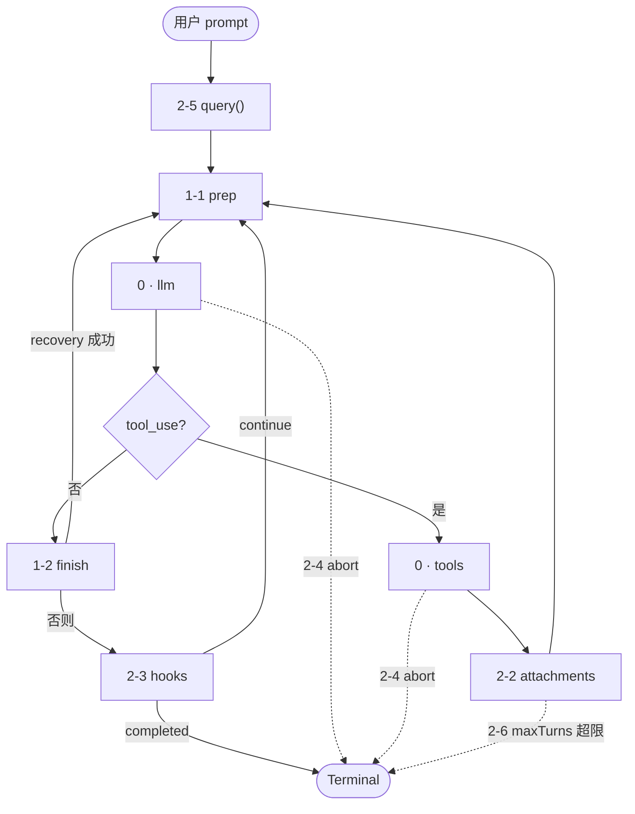
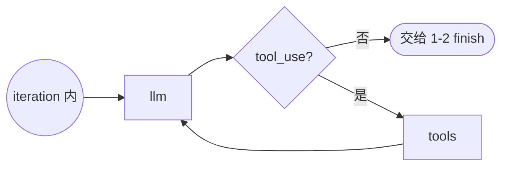
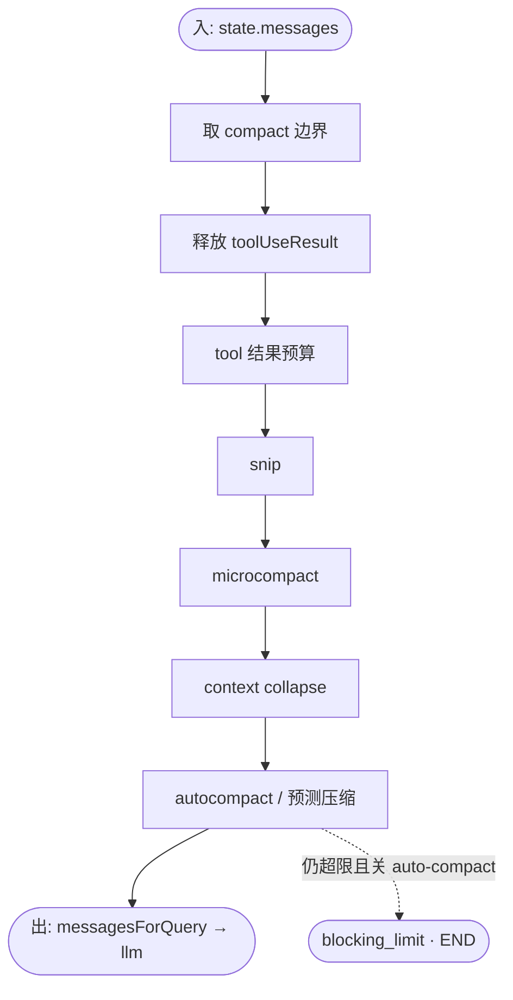
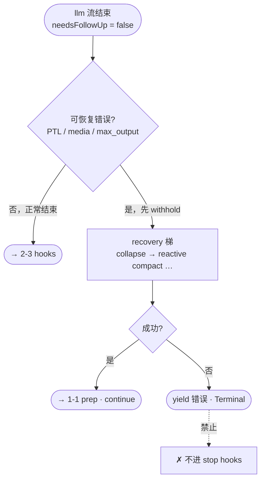
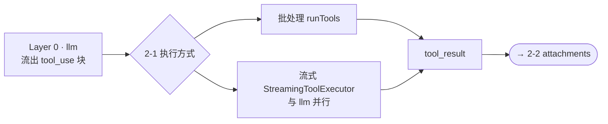
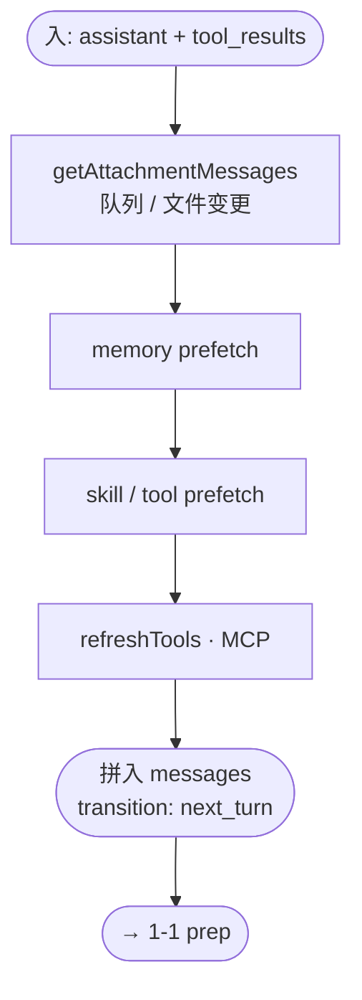
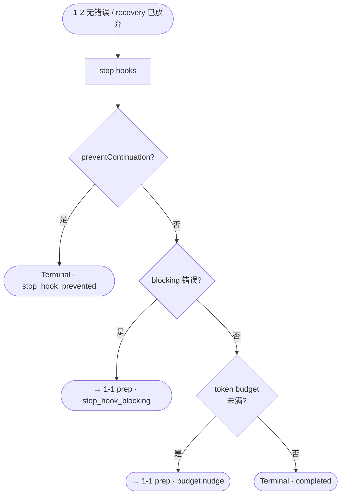
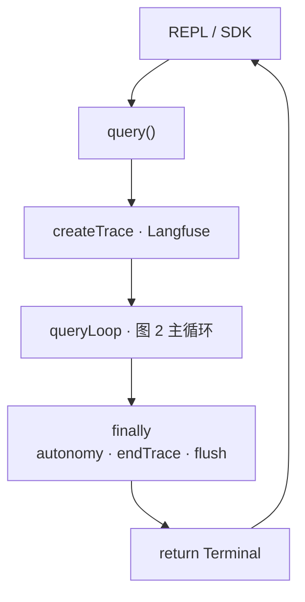

# query() 的故事：ReAct + 两层壳

> **讲故事 = 画架构**：Layer 0 内核 → Layer 1 上下文壳 → Layer 2 编排壳。没有「叙事三层、架构两层」两套说法。
>
> 相关笔记：[startup-to-query-walkthrough.md](./startup-to-query-walkthrough.md)（从 CLI 到 `query()` 的调用链）。

---

## 一句话

**内核永远是 ReAct**（`llm ⇄ tools`）；外面只加 **两层壳**——先 **上下文壳**（messages 能进、能出 API），再 **编排壳**（怎么跑 tool、注入什么、何时结束 turn）。

---

## 怎么读（三章）

| 章 | 问的问题 | 在循环里的位置 |
|----|----------|----------------|
| **Layer 0** | 模型怎么推理、要不要调 tool？ | `llm ⇄ tools` |
| **Layer 1** | 上下文塞不进 / API 报错怎么修 messages？ | **1-1 prep** + **1-2 finish** |
| **Layer 2** | 运行时谁执行 tool、塞什么附件、何时算完？ | **2-1** tools → **2-2** attachments → **2-3** hooks → **2-4** abort → **2-5** wrapper |

### 图 1：三层各管什么（静态）

**不是**执行顺序；顺序只看 **图 2**。

| 层 | 关切 | 对应节点（图 2） |
|----|------|------------------|
| **Layer 1** 上下文壳 | `messages` 能否进/出 API | `1-1 prep`、`1-2 finish` |
| **Layer 0** 内核 | 推理与 tool 循环 | `llm`、`tools` |
| **Layer 2** 编排壳 | 怎么执行、注入什么、何时结束 | `2-1` … `2-6`、`2-5` 外圈 |

### 图 2：主循环（控制流 — 全文唯一总图）

**每次 `while` iteration** 走一遍；`2-5 query()` 在环外包裹整次调用。



| 图 2 补充 | 说明 |
|-----------|------|
| 任意节点 → `END` 虚线 | `2-4 abort` 可在 stream / tools 触发 |
| `attachments` → `END` 虚线 | `2-6 maxTurns` 超限 |
| 回 `prep` | 新一轮 iteration（`next_turn`、recovery、hook blocking、budget…） |
| `Terminal` 之后 | `2-5 finally`：trace、autonomy，见 **图 10** |

---

## Layer 0：最普通的 ReAct

### 图 3：Layer 0 内核（仅 ReAct）

不含 prep / hooks；对应 **图 2** 里的 `llm ⇄ tools` 段。



### 伪代码

```python
def react_loop(messages):
    while True:
        assistant = call_llm(messages)
        yield assistant

        if not has_tool_use(assistant):
            return  # done

        results = run_tools(assistant.tool_uses)
        yield results
        messages = messages + [assistant] + results
```

### 对应源码（骨架）

`queryLoop` 的本质就是 `while (true)` + 两条出路：

| 分支 | 条件 | 行为 |
|------|------|------|
| 结束 | `!needsFollowUp` | 无 `tool_use` → 退出循环 |
| 继续 | `needsFollowUp` | 跑 tools → `messages.concat(assistant, toolResults)` → `continue` |

```734:741:src/query.ts
    const assistantMessages: AssistantMessage[] = []
    const toolResults: (UserMessage | AttachmentMessage)[] = []
    // stop_reason === 'tool_use' is unreliable
    const toolUseBlocks: ToolUseBlock[] = []
    let needsFollowUp = false
```

```1075:1077:src/query.ts
              if (msgToolUseBlocks.length > 0) {
                toolUseBlocks.push(...msgToolUseBlocks)
                needsFollowUp = true
```

```1334:1334:src/query.ts
    if (!needsFollowUp) {
```

```2027:2040:src/query.ts
    const next: State = {
      messages: messagesForQuery.concat(assistantMessages, toolResults),
      // ...
      transition: { reason: 'next_turn' },
    }
    state = next
```

**注意**：不靠 `stop_reason === 'tool_use'`，只看 stream 里有没有 `tool_use` block。

---

## Layer 1：上下文壳

**关切**：`messages` 能否合法、完整地进入下一次 API 调用。

分两段，**同一层、两个时刻**：

| 段 | 时机 | 做什么 |
|----|------|--------|
| **1-1 prep（主动）** | 每次 `callModel` **之前** | snip / microcompact / autocompact… |
| **1-2 finish（被动）** | `callModel` **之后**、且无 `tool_use` | withhold → recovery（413 / media / max_output） |

### 为什么需要上下文壳

纯 ReAct 假设 `messages` 永远能塞进模型窗口。长会话会在 **调 API 前** 就爆（prep 解决），或在 **调 API 后** 才暴露（finish 解决）。两层壳里的第一层只改 messages，不改 ReAct 图。

### 1-1 — prep（主动）

对应 **图 2** 每次进 `llm` 之前；**线性管线**，不是环。

### 图 4：1-1 prep 管线



### prep 步骤表（与图 4 对照）

| 步骤 | 模块 | 作用 |
|------|------|------|
| 1 | `getMessagesAfterCompactBoundary` | 只取 compact 边界后的消息 |
| 2 | 释放 `toolUseResult` | 减内存，API 只需 `tool_result` content |
| 3 | `applyToolResultBudget` | 超大 tool 输出截断/替换 |
| 4 | `snipCompactIfNeeded` | HISTORY_SNIP：删旧历史 |
| 5 | `microcompact` | 压缩 tool 结果 |
| 6 | `applyCollapsesIfNeeded` | CONTEXT_COLLAPSE：折叠段落 |
| 7 | `autocompact` | 主动摘要压缩 |
| 8 | predictive autocompact | 预测本 turn 增长，提前压 |

主动 compact 成功时会 **yield 摘要消息** 并替换 `messagesForQuery`，然后才进 LLM——仍是同一次 iteration 里的 prep，不是新节点。

```636:718:src/query.ts
    const { compactionResult, consecutiveFailures } = await deps.autocompact(
      messagesForQuery,
      // ...
    )
    if (compactionResult) {
      // ...
      for (const message of postCompactMessages) {
        yield message
      }
      messagesForQuery = postCompactMessages
    }
```

### blocking limit（prep 的硬出口）

当 **关闭 auto-compact** 且 token 已达硬上限时，**不调 LLM**，直接 `Terminal: blocking_limit`——上下文壳在 ReAct 环外最常见的提前结束。

```811:829:src/query.ts
      if (isAtBlockingLimit) {
        yield createAssistantAPIErrorMessage({ /* PROMPT_TOO_LONG */ })
        return { reason: 'blocking_limit' }
      }
```

### 1-2 — finish（被动）：错误与恢复

对应 **图 2**「无 tool」分支；在 `llm` 之后、`2-3 hooks` 之前。

### 图 5：1-2 finish（无 tool 出口）



流式阶段对 **可恢复错误 withhold**（先不 yield 给用户），在 `!needsFollowUp` 分支里尝试恢复，失败再 `END`。

```1026:1062:src/query.ts
            // Withhold recoverable errors until recovery can succeed
            let withheld = false
            // PTL / media / max_output_tokens ...
            if (!withheld) {
              yield yieldMessage
            }
```

| 错误 | 恢复策略 | continue 原因 |
|------|----------|----------------|
| prompt too long (413) | context collapse drain → reactive compact | `collapse_drain_retry` / `reactive_compact_retry` |
| media 过大 | reactive compact 剥媒体 | `reactive_compact_retry` |
| max_output_tokens | 8k→64k 一次 escalate，或注入 meta 续写 ≤3 次 | `max_output_tokens_escalate` / `max_output_tokens_recovery` |

恢复成功 = **改 `state.messages` 后 `continue`**，回到 **prep**，再进 LLM——仍是 ReAct，只是 messages 被换过。

### Layer 1 小结

| 段 | 源码（约） |
|----|------------|
| **1-1 prep** | `522–873` |
| **1-2 finish** | `1026–1062`（withhold），`1334–1528`（recovery） |

- 环仍是 `prep → llm → …`；finish 只在 **无 tool** 的出口上生效。
- recovery 与 prep **同属上下文壳**，不要拆成「叙事第二章」。

---

## Layer 2：编排壳

**关切**：ReAct 内核跑起来之后，**运行时**怎么执行 tool、往对话里 **注入什么**、**何时结束** turn / 整次 `query()`。

分六节（都在内核外侧，不改变 `llm ⇄ tools` 两节点）：

| 节 | 时机 | 做什么 |
|----|------|--------|
| **2-1** tools 执行 | 有 `tool_use` | 权限、并行流式执行 |
| **2-2** attachments | tools 之后 | 队列、memory/skill prefetch、拼回 messages |
| **2-3** turn 结束 | 无 tool、recovery 完后 | stop hooks、token budget |
| **2-4** 中断 | stream / tools 两路 | abort、`aborted_*` |
| **2-5** 进程级 | `query()` 外圈 | Langfuse、autonomy finally |
| **2-6** 边界 | 工具路径末尾等 | `maxTurns`、`Terminal` 类型 |

### 2-1 — tools 执行（内核的「怎么跑」）

对应 **图 2**「有 tool」分支里的 `tools` 节点；**不改变** `llm → tools` 拓扑，只改执行策略。

### 图 6：2-1 与 Layer 0 tools 的关系



| 步骤 | 作用 |
|------|------|
| `runTools` / `StreamingToolExecutor` | 权限、执行、yield tool_result；可与 llm 并行 |
| fallback / `discard()` | 换模型重试时清 orphan tool_result |

`StreamingToolExecutor` **不改变图**——仍是 `llm → tools`，只重叠时间。

源码：约 `1635–1683`。

### 2-2 — attachments（tool 后注入）

对应 **图 2** 中 `tools` 之后、`回 prep` 之前。

### 图 7：2-2 注入什么



**内核**产出 `tool_result` 之后，编排壳注入 **非 tool 因果链** 的上下文：

```1879:1888:src/query.ts
    for await (const attachment of getAttachmentMessages(
      null,
      updatedToolUseContext,
      null,
      queuedAutonomyClaim.attachmentCommands,
      messagesForQuery.concat(assistantMessages, toolResults),
      querySource,
    )) {
      yield attachment
      toolResults.push(attachment)
    }
```

| 注入来源 | 作用 |
|----------|------|
| `getAttachmentMessages` | 队列命令、文件变更等 |
| memory / skill / tool prefetch | 异步预取结果 |
| `refreshTools` | MCP 新连上的工具 |

然后 `messages += assistant + toolResults`，`transition: next_turn` → 下一轮 **Layer 1 prep**。

源码：约 `1826–1985`。

### 2-3 — turn 结束：stop hooks & token budget

对应 **图 5** 正常出口 → **图 2** 的 `2-3 hooks` 节点。

### 图 8：2-3 turn 如何结束



无 `tool_use` 且 recovery 都失败后，才进入「这一轮算不算完」的产品逻辑：

```1542:1630:src/query.ts
      const stopHookResult = yield* handleStopHooks(...)
      if (stopHookResult.preventContinuation) {
        return { reason: 'stop_hook_prevented' }
      }
      if (stopHookResult.blockingErrors.length > 0) {
        // continue → stop_hook_blocking → 回到 prep
      }
      if (feature('TOKEN_BUDGET')) {
        const decision = checkTokenBudget(...)
        if (decision.action === 'continue') {
          // 注入 meta nudge → token_budget_continuation → prep
        }
      }
      return { reason: 'completed' }
```

| 机制 | 效果 |
|------|------|
| stop hook 阻止 | `stop_hook_prevented` → END |
| stop hook 注入 blocking 错误 | 当作新 user 消息 → **continue**（又一整轮 ReAct） |
| token budget 未满 | meta nudge → **continue**（模型继续干，不算新用户 turn） |

### 2-4 — 中断（Abort，横切）

在 **图 2** 上标为虚线：可在 `llm` 流中或 `tools` 后触发，直接 `Terminal`。

### 图 9：2-4 两个出口（对照图 2）

| 时机 | 图 2 位置 | Terminal |
|------|-----------|----------|
| stream 中 Ctrl+C | `llm` 之后 | `aborted_streaming` |
| tool 执行中 Ctrl+C | `2-2` 之前 | `aborted_tools` |

`StreamingToolExecutor` 会为未完成的 tool 合成 `tool_result`，避免 API 缺对。

### 2-5 — 外层 `query()` 包装（进程级）

包住 **图 2 整圈**；`queryLoop` 返回后执行 `finally`，**不参与** iteration 环。

### 图 10：2-5 与 queryLoop 的关系



`queryLoop` 之上还有薄包装，**不参与 ReAct 环**：

```275:390:src/query.ts
export async function* query(params) {
  // Langfuse trace
  try {
    terminal = yield* queryLoop(...)
  } finally {
    // autonomy 队列收尾、endTrace、flushLangfuse、GC
  }
  // notifyCommandLifecycle('completed')
  return terminal
}
```

### 2-6 — `maxTurns` 与 `Terminal` 全集

工具路径末尾检查 `maxTurns`；各类 `Terminal` 定义在 `src/query/transitions.ts`。

```1:21:src/query/transitions.ts
export type Terminal =
  | { reason: 'completed' }
  | { reason: 'blocking_limit' }
  | { reason: 'image_error' }
  | { reason: 'model_error'; error?: unknown }
  | { reason: 'aborted_streaming' }
  | { reason: 'aborted_tools' }
  | { reason: 'prompt_too_long' }
  | { reason: 'stop_hook_prevented' }
  | { reason: 'hook_stopped' }
  | { reason: 'max_turns'; turnCount: number }

export type Continue =
  | { reason: 'collapse_drain_retry'; committed: number }
  | { reason: 'reactive_compact_retry' }
  | { reason: 'max_output_tokens_escalate' }
  | { reason: 'max_output_tokens_recovery'; attempt: number }
  | { reason: 'stop_hook_blocking' }
  | { reason: 'token_budget_continuation' }
  | { reason: 'next_turn' }
```

### Layer 2 小结

| 块 | 源码（约） |
|----|------------|
| **2-1 tools** | `1635–1683` |
| **2-2 attachments** | `1826–1985` |
| **2-3 hooks / budget** | `1542–1630` |
| **2-4 abort** | `1287–1323`，`1764–1794` |
| **2-5 wrapper** | `275–390` |
| **2-6 maxTurns / Terminal** | `1787–1794`，`transitions.ts` |

- **不改 ReAct 拓扑**；管的是执行、注入、结束规则。
- `Continue`（含 `next_turn`）→ 回 **Layer 1 prep**；`Terminal` → 整次 `query()` 结束。

---

## 完整故事：三章走完一次用户 turn

> 控制流只认 **图 2**；各章细节见 **图 3–10**，勿再画第二圈环。

### 图例索引

| 图 | 内容 |
|----|------|
| **图 1** | 三层职责（静态） |
| **图 2** | **主循环**（全文总图） |
| **图 3** | Layer 0 内核 ReAct |
| **图 4** | 1-1 prep 管线 |
| **图 5** | 1-2 finish / recovery |
| **图 6** | 2-1 tools 执行方式 |
| **图 7** | 2-2 attachments |
| **图 8** | 2-3 hooks / budget |
| **图 9** | 2-4 abort（表） |
| **图 10** | 2-5 query() 包装 |

### 一章一表

| 章 | 解决的问题 | 主要代码 |
|----|------------|----------|
| **Layer 0** | 推理 + tool 循环 | `callModel` ⇄ `runTools`，`needsFollowUp` |
| **Layer 1** | messages 进/出 API | prep `522–873`；finish `1334–1528` |
| **Layer 2** | 运行时编排 | tools `1635–1683`；attachments `1826–1985`；hooks `1542–1630`；`query()` `275–390` |

### 单次用户消息的生命周期

1. **REPL** → `query(messages, …)`（见 [startup-to-query-walkthrough](./startup-to-query-walkthrough.md)）。
2. **Layer 2-5**：`query()` 建 trace，进入 `queryLoop`。
3. **Layer 1-1 prep**：压 messages，可能 yield compact。
4. **Layer 0 llm**：流式；有 `tool_use` → `needsFollowUp`。
5. **若无 tool**：**Layer 1-2 finish**（recovery）→ **Layer 2-3 hooks** → `completed` 或 continue。
6. **若有 tool**：**Layer 2-1 tools** → **Layer 2-2 attachments** → `next_turn`。
7. 回到步骤 3，直到 **Terminal** / **maxTurns**。
8. **Layer 2-5 finally**：autonomy、flush trace → 返回 REPL。

### 和「复杂图」的关系

若把 snip、reactive compact、stop_hook_blocking 各拆成 LangGraph 节点，会得到 15+ 节点——那是 **实现展开图**。

**架构 / 教学只保留图 2**。图 3–10 是 **局部放大**，不要各自再画一整圈环。

---

## 附录：Continue 何时回到 prep

| `transition.reason` | 触发场景 |
|---------------------|----------|
| `next_turn` | 正常 tool 批结束 |
| `collapse_drain_retry` | withheld PTL，collapse 提交成功 |
| `reactive_compact_retry` | withheld PTL/media，被动 compact 成功 |
| `max_output_tokens_escalate` | 8k cap 提到 64k 重试 |
| `max_output_tokens_recovery` | 注入 meta 续写 |
| `stop_hook_blocking` | stop hook 返回 blocking 错误 |
| `token_budget_continuation` | 输出 token 预算未满，注入 nudge |

全部 = `state = next; continue` → 下一轮 iteration 从 **prep** 开始。

---

## 值得学习的点

读 `query.ts` 不是为了背 2000 行，而是学 **「在 ReAct 不变的前提下，怎么把生产问题一层层挂上去而不烂掉」**。下面按「架构 → 协议 → 工程」归纳。

### 1. 讲故事就按两壳：与架构同一套章节

**可学**：**Layer 0 内核 → Layer 1 上下文壳 → Layer 2 编排壳**。prep 与 finish 都是第一章（改 messages）；attachments 与 hooks 都是第二章（改运行时）。不要另起「叙事第三层」。

**好处**：

- 带人读源码：先找 prep/finish，再找 attachments/hooks。
- Code review 只问两问：**messages 进不进得了 API？** **运行时规则对不对？**
- 换 LangGraph：两壳 = 两组 middleware，内核仍是 `llm` / `tools`。

**反例**：把 finish 单开成「Layer 2」、hooks 单开成「Layer 3」——读者会以为有三块壳；其实只有两壳。

---

### 2. 用可靠信号驱动分支，别信 API 的「暗示」

**可学**：循环是否继续，看 **自己从 stream 里数出来的 `tool_use` block**（`needsFollowUp`），不看 `stop_reason === 'tool_use'`。

```736:738:src/query.ts
    // Note: stop_reason === 'tool_use' is unreliable -- it's not always set correctly.
```

**推广**：凡是「模型/API 说完成了」的字段，在 agent 里都应 **用结构化 content 二次确认**（tool_use、thinking block 规则等同理）。

---

### 3. Withhold → Recover → Surface：错误也有状态机

**可学**：可恢复错误（PTL、media 过大、max_output_tokens）在 stream 里 **先 withhold**，recovery 成功则 `continue`，失败才 `yield` 并 `END`。

**为什么**：

- SDK/桌面端看到 `error` 字段会直接结束会话；中间态错误是 **实现细节**，不是用户该看到的终态。
- recovery 路径（collapse drain → reactive compact）是 **有顺序的降级梯**，不是平等 catch-all。

**推广**：对外 streaming API 要区分 **「可重试 / 可修复」** 与 **「终态错误」**；别在第一次 413 就把错误推给 UI。

---

### 4. 明确禁止「错误 + stop hook」死亡螺旋

**可学**：API 错误（尤其 prompt-too-long）**不要 fall through 到 stop hooks**——hook 会注入更多 token，下一轮再 413，循环烧 API。

```1440:1444:src/query.ts
        // No recovery — surface the withheld error and exit. Do NOT fall
        // through to stop hooks: the model never produced a valid response,
        // so hooks have nothing meaningful to evaluate.
```

**推广**：任何「失败后自动再跑一轮 LLM」的路径，都要问：**上一轮算不算有效 assistant turn？** 无效则 hook/validator 应跳过。

---

### 5. 一个 `while (true)` + 显式 `State`，胜过深层递归

**可学**：agentic 多轮用 **`state = next; continue`**，不用 `query()` 调自己。

**配套**：

- `State` 类型集中可变字段（messages、recovery 计数、compact tracking）。
- `transition: Continue` 记录 **为何 continue**，测试可断言路径而不扒 messages。

```270:272:src/query.ts
  // Why the previous iteration continued. Undefined on first iteration.
  // Lets tests assert recovery paths fired without inspecting message contents.
```

**推广**：LangGraph 的 loop edge、Temporal 的 continue-as-new，都是同一思想—— **栈上递归在长会话里既难测又难观测**。

---

### 6. Recovery 守卫要带「记忆」，不能每轮清零

**可学**：`hasAttemptedReactiveCompact` 在 `stop_hook_blocking` continue 时 **不能 reset**，否则 compact → 仍太长 → hook 注入 → 再 compact 无限循环（注释里写过真实事故）。

**推广**：凡「昂贵、有上限」的 recovery（compact、换模型、删图），用 **session 级 guard** 或 circuit breaker，别绑在「新一轮 iteration」上自动清零。

---

### 7. Prep 分层：先便宜后昂贵

**可学**：压缩管线顺序是 **snip → microcompact → collapse → autocompact**，且 collapse 在 autocompact **之前**——能在保持细粒度上下文时就不做整段摘要。

**推广**：上下文治理做成 **pipeline**，每级有明确输入输出；避免「一上来就 summary 一切」。

---

### 8. 流式与 ReAct 正交：StreamingToolExecutor

**可学**：图仍是 `llm → tools`，但 tools 可在 **llm 还在吐 token 时** 并行启动；图不变，延迟变低。

**注意**：fallback / abort 时要 `discard()` executor，避免 orphan `tool_result`——**并行化必须和取消语义一起设计**。

---

### 9. AsyncGenerator 作为「运行时协议」

**可学**：`query()` 是 `AsyncGenerator<StreamEvent | Message | …, Terminal>`——边跑边 `yield` 给 REPL/SDK，最后用 **return value** 交 `Terminal`。

**好处**：

- UI、transcript、权限弹窗都订阅同一流，不必等整 turn 结束。
- `Terminal` 与 yield 的内容分离：**表现层事件** vs **业务结局**。

**推广**：自建 agent 时，尽早定 **「流式中间件 + 终态枚举」**，别只用 Promise&lt;string&gt;。

---

### 10. 依赖注入与 feature flag：可测、可裁剪

**可学**：

- `QueryDeps`（`callModel`、`autocompact`、`microcompact`）让 loop **不绑死**具体 API 实现，测试可 stub。
- `feature('X')` + 动态 `require` 让 **外部构建能砍掉整段逻辑**（Bun tree-shaking 约束：`feature()` 只能写在 `if` 条件里）。

**推广**：核心 loop 文件应保持 **「纯控制流 + 注入副作用」**；副作用散落在 deps 和 feature 门后。

---

### 11. 内存与观测：长会话要主动「漏放」

**可学**（容易忽略的生产细节）：

- 每轮 prep 删掉已渲染的 `toolUseResult`，避免 400KB read 结果常驻 heap。
- `createDumpPromptsFetch` **每 session 一个**，避免闭包攒齐所有 request body。
- `query()` 的 `finally`：`endTrace` → `flushLangfuse` → 清空 trace 引用 → `performance.clearMarks()`，防 OTel/JSC 在长进程里胀到数百 MB。

**推广**：agent 默认是 **小时级进程**，GC 假设不成立；要在 loop 里设计 **释放点**。

---

### 12. Attachments 与 Tool 分离：「模型要的」vs「运行时塞的」

**可学**：`tool_result` 是模型 tool call 的因果链；`getAttachmentMessages`（队列、memory、skill prefetch）是 **编排层在 turn 间隙注入的上下文**，拼进 `messages` 再走 prep。

**推广**：别把 cron 通知、RAG、子 agent 结果都伪装成 tool——除非你真的走了 tool 权限与审计链；否则单独一条 **attachment / system inject** 通道更清晰。

---

### 13. 写自己的 agent 时的最小清单

| 问题 | query.ts 的做法 |
|------|-----------------|
| 循环条件是什么？ | 有 `tool_use` → tools；无 → finish |
| 上下文爆了怎么办？ | **上下文壳**：prep（主动）+ finish recovery（被动） |
| tool 后还要塞什么？ | **编排壳**：attachments，别伪装成 tool_result |
| 用户中断怎么办？ | **编排·横切**：`aborted_streaming` / `aborted_tools` |
| 怎么避免 hook 放大故障？ | API 无效响应不跑 stop hooks |
| 怎么测路径？ | `transition.reason` + `QueryDeps` mock |
| 怎么保持可读？ | 三章：0 内核 → 1 上下文壳 → 2 编排壳 |

---

## 延伸阅读

- 官方：[Agentic Loop](../../docs/conversation/the-loop.mdx)
- 本仓库架构白皮书：[architecture-overview.mdx](../../docs/introduction/architecture-overview.mdx)
- 启动链笔记：[startup-to-query-walkthrough.md](./startup-to-query-walkthrough.md)
