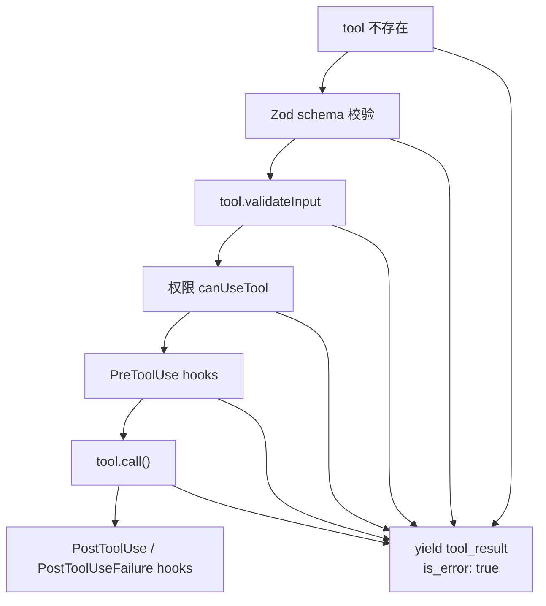

# Tool Error 作为 Feedback：Agent Loop 设计技巧

> Agent loop 的关键设计之一：把 tool error **当作下一轮推理的 observation**，而不是 throw 终止 loop。本文整理通用原则与本仓库实现对照。
>
> 相关笔记：[query-react-three-layers.md](./query-react-three-layers.md)（2-1 tools 执行、2-4 abort）、[startup-to-query-walkthrough.md](./startup-to-query-walkthrough.md)。

---

## 一句话

**`tool_use` 必须成对出现 `tool_result`；失败用 `is_error: true` 表达；error 文案要 actionable；loop 在 error 后继续，让模型 self-correct。**

---

## 1. 核心契约：协议完整性 vs 业务失败

Anthropic Messages API 要求 assistant 的 `tool_use` 与 user 的 `tool_result` 严格配对。缺一对 → transcript 非法 → loop 断掉。

| 层次 | 做法 |
|------|------|
| **协议层** | 任何路径都 yield `tool_result`（含 synthetic） |
| **语义层** | 用 `is_error: true` 标记失败，与成功 output 区分 |
| **行为层** | 普通 tool error **不是** terminal；追加 messages 后再调 llm |

### 1.1 执行层 catch → tool_result

`runToolUse` 最外层 catch 不 throw，而是 yield 标准 error block：

```498:517:src/services/tools/toolExecution.ts
  } catch (error) {
    // ...
    yield {
      message: createUserMessage({
        content: [
          {
            type: 'tool_result',
            content: `<tool_use_error>${detailedError}</tool_use_error>`,
            is_error: true,
            tool_use_id: toolUse.id,
          },
        ],
        // ...
      }),
    }
  }
```

### 1.2 运行时崩溃 → 补 orphan tool_result

模型流已 emit `tool_use`，但 runtime 在 emit `tool_result` 前失败（API bug、进程异常）。`yieldMissingToolResultBlocks` 为每个 orphan 补 synthetic error：

```148:177:src/query.ts
function* yieldMissingToolResultBlocks(
  assistantMessages: AssistantMessage[],
  errorMessage: string,
) {
  for (const toolUse of toolUseBlocks) {
    yield createUserMessage({
      content: [
        {
          type: 'tool_result',
          content: errorMessage,
          is_error: true,
          tool_use_id: toolUse.id,
        },
      ],
      // ...
    })
  }
}
```

调用点：`query.ts` 中 model/runtime 异常路径（约 1230 行注释写明：避免 SDK 看到 phantom interrupt）。

### 1.3 并行 / 取消 → synthetic error

`StreamingToolExecutor.createSyntheticErrorMessage` 为被取消的 sibling tool 补 result，原因包括：

| reason | 典型场景 |
|--------|----------|
| `sibling_error` | 并行 Bash 失败，依赖链上的 sibling 无意义继续 |
| `user_interrupted` | 用户 ESC 拒绝 / abort |
| `streaming_fallback` | 换模型重试，`discard()` 后丢弃的执行 |

源码：`src/services/tools/StreamingToolExecutor.ts` 约 180–231 行。

---

## 2. 错误分层：越早失败，越好修

执行顺序（`checkPermissionsAndCallTool`）：



每一层都返回 **模型可理解的文案**，而不是裸 exception。

| 阶段 | error 前缀 / 类型 | 源码 |
|------|-------------------|------|
| 工具不存在 | `No such tool available` | `toolExecution.ts` ~430 |
| Schema | `InputValidationError:` + `formatZodValidationError` | `toolExecution.ts` ~656–721 |
| 业务校验 | `tool.validateInput` 的 message | ~724–774 |
| 权限拒绝 | `permissionDecision.message` 或 hook 文案 | ~1037–1113 |
| Runtime | `formatError(error)` | ~1777–1823 |

---

## 3. Actionable Error：告诉模型「改什么」

### 3.1 Zod → 自然语言

`formatZodValidationError` 把 Zod issue 拆成：

- 缺参：`The required parameter \`foo\` is missing`
- 多余参：`An unexpected parameter \`bar\` was provided`
- 类型错：`expected \`array\` but provided as \`string\``

源码：`src/utils/toolErrors.ts`。

### 3.2 Error-as-instruction：延迟工具 schema 未下发

裸 Zod 错误（如 `expected array, got string`）模型不懂要先 discover tool。`buildSchemaNotSentHint` 在 error 末尾追加完整 recovery playbook（SearchExtraTools → 再调目标工具）。

源码：`src/services/tools/toolExecution.ts` ~607–638。

### 3.3 Shell 错误要带 exit code + stdout + stderr

```24:40:src/utils/toolErrors.ts
export function getErrorParts(error: Error): string[] {
  if (error instanceof ShellError) {
    return [
      `Exit code ${error.code}`,
      error.interrupted ? INTERRUPT_MESSAGE_FOR_TOOL_USE : '',
      error.stderr,
      error.stdout,
    ]
  }
  // ...
}
```

模型看到 `Exit code 127` + `command not found` 远比 `Command failed` 有用。

### 3.4 体积控制：头尾保留

`formatError` 超过 10KB 时保留前 5KB + 后 5KB，中间标注截断字符数——避免 error 吃掉 context，又保留首尾关键信息。

---

## 4. 语义分层：同一种 `is_error`，不同 agent 行为

| 类型 | 模型应做什么 | 本仓库文案 |
|------|-------------|-----------|
| **系统 / 工具错误** | 修正参数、换策略、重试 | `<tool_use_error>…</tool_use_error>` |
| **用户拒绝权限** | **STOP**，等用户指示；强调 side effect 未发生 | `REJECT_MESSAGE` |
| **用户中断** | 停止当前动作 | `INTERRUPT_MESSAGE_FOR_TOOL_USE` / `CANCEL_MESSAGE` |
| **Subagent 拒绝** | 换路径或上报限制 | `SUBAGENT_REJECT_MESSAGE` |

常量定义：`src/utils/messages.ts` ~208–220。

### 4.1 拒绝 + Memory hint

用户拒绝时，`withMemoryCorrectionHint` 追加提示：下一条 user message 可能是 correction，考虑写入 memory。

用于：`StreamingToolExecutor` 的 `user_interrupted`、`PermissionContext` 等。

### 4.2 PermissionDenied hook → 允许重试

classifier 拒绝后，若 hook 返回 `{ retry: true }`，追加 meta message 告诉模型「现在可以重试」。

源码：`toolExecution.ts` ~1115–1142。

---

## 5. 结构化标记：`<tool_use_error>` 标签

错误包在 `<tool_use_error>…</tool_use_error>` 内：

- UI 非 verbose 模式用 `extractTag(result, 'tool_use_error')` 简洁展示（Glob/Grep/FileEdit 等 Tool UI）
- 与正常 tool output 格式可区分
- API 只有 text `content` 时的轻量 markup 折中

---

## 6. 并行工具的 cascade 策略

并非所有 parallel tool error 都 cancel sibling：

```383:390:src/services/tools/StreamingToolExecutor.ts
          // Only Bash errors cancel siblings. Bash commands often have implicit
          // dependency chains (e.g. mkdir fails → subsequent commands pointless).
          // Read/WebFetch/etc are independent — one failure shouldn't nuke the rest.
          if (tool.block.name === BASH_TOOL_NAME) {
            this.hasErrored = true
            this.siblingAbortController.abort('sibling_error')
          }
```

**原则**：只有**隐式依赖链**才 cascade；独立 read/search 失败不影响其他并行读。

---

## 7. Error 之后 loop 继续（self-correction）

Tool error 返回后，`queryLoop` 将 `toolResults` 拼入 `messages`，走 attachments → **下一轮 prep → llm**。典型 trajectory：

```
assistant: [tool_use: Bash("npm test")]
user:      [tool_result is_error: Exit code 1, …failures…]
assistant: [tool_use: Bash("npm test -- --grep failing")]   ← 自我修正
```

**停止条件**（error 本身不触发）：

- `shouldPreventContinuation`（PreToolUse hook stop）
- 用户 abort → `aborted_tools`
- `maxTurns` 超限
- stop hook 返回 completed

普通 tool error = **下一 turn 的 input**，不是 exception handler 终点。

---

## 8. Observability & Hooks

失败路径与成功路径对称：

| 机制 | 作用 |
|------|------|
| `logEvent('tengu_tool_use_error', …)` | 分析 error 类型分布 |
| `classifyToolError` | telemetry-safe 分类（errno code、稳定 error.name） |
| `runPostToolUseFailureHooks` | error 后注入额外 context |
| skill learning `sessionObserver` | 标记 error→修正→成功 为 positive outcome |

---

## 9. 与三层架构的对应关系

对照 [query-react-three-layers.md](./query-react-three-layers.md)：

| 层 | tool error 关切 |
|----|-----------------|
| **Layer 0** | `tool_result(is_error)` 是 ReAct observe 步的标准输入 |
| **Layer 1** | orphan 补全、messages 顺序（tool_result 不能与普通 user 交错） |
| **Layer 2 · 2-1** | 权限/并行/synthetic error 的执行策略 |
| **Layer 2 · 2-4** | abort 时 synthetic result，避免 API 缺对 |

---

## 10. 设计 Checklist

1. **Never orphan a `tool_use`** — 任何失败都补 `tool_result`
2. **Always set `is_error: true`** — 模型与 executor 共用 failure channel
3. **Fail fast with actionable messages** — 校验层比 runtime 更便宜、更好修
4. **Separate error kinds in copy** — 系统错 vs 用户拒 vs 中断，行为指令不同
5. **Include recovery hints in the error** — 不只说 what failed，要说 how to fix
6. **Rich context for opaque failures** — exit code、stderr、field name
7. **Bound error size** — truncate with structure（头尾保留）
8. **Cascade only real dependencies** — Bash yes，独立 Read no
9. **Keep the loop alive** — error 是下一 turn 的 input
10. **Treat error format as prompt contract** — UI、hooks、模型解析依赖同一格式

---

## 11. 关键源码索引

| 模块 | 路径 |
|------|------|
| 工具执行主路径 | `src/services/tools/toolExecution.ts` |
| 流式并行执行 | `src/services/tools/StreamingToolExecutor.ts` |
| Error 格式化 | `src/utils/toolErrors.ts` |
| 拒绝/中断常量 | `src/utils/messages.ts` |
| orphan 补全 | `src/query.ts` → `yieldMissingToolResultBlocks` |
| PostToolUseFailure | `src/services/tools/toolHooks.ts` |

---

## 延伸阅读

- 官方：[Agentic Loop](../../docs/conversation/the-loop.mdx)
- 三层架构：[query-react-three-layers.md](./query-react-three-layers.md)
- System reminder 与 tool_result 渲染：[system-reminder-architecture.md](../../docs/internals/system-reminder-architecture.md)
