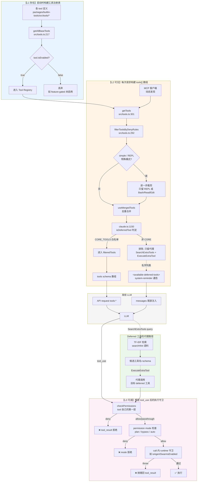
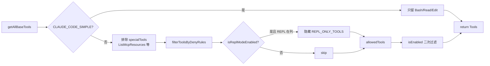
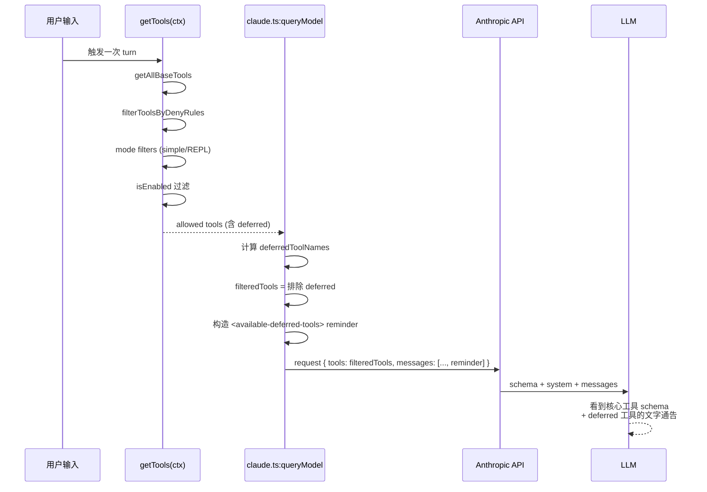
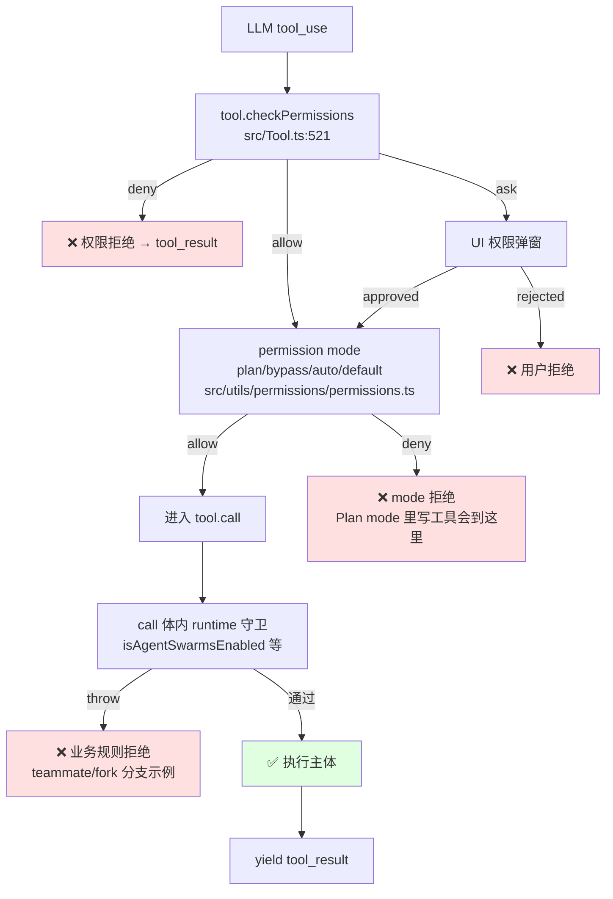
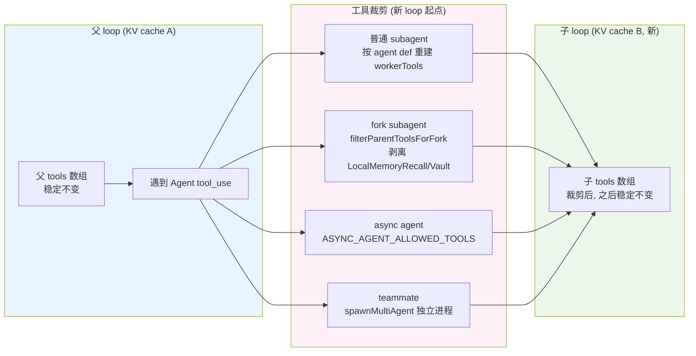

# Claude Code 工具（Tools）机制总览

> 一份图文并茂的完整梳理：工具从注册到执行的全链路，三层解耦模型，Mask 与 Remove 的边界。
>
> 前置阅读（可选）：
> - `.shousui/notes/subagent-spawn-mechanism.md` — AgentTool 与 subagent 生命周期
> - `.shousui/notes/tool-registration-and-deferred-tools.md` — Team/deferred 工具速查
> - `.shousui/notes/mask-dont-remove.md` — Manus 原则的对应关系

## 零、心智模型：三层解耦

一个工具从「代码里存在」到「模型真的调到它」中间有**三道独立闸门**，绝不能混为一谈：

| 层次 | 语义 | 决定因素 | Model 感知 |
|------|------|----------|------------|
| **L1 存在** | 注册表里有这个 Tool 对象 | `getAllBaseTools()` + `tool.isEnabled()` | 无（内部） |
| **L2 可见** | 进入 API 请求的 `tools:[]` 数组 | `CORE_TOOLS` 白名单 + deny 规则 + mode 过滤 + `filteredTools` | 出现在 tool schema |
| **L3 可调** | `call()` 真正执行到主体逻辑 | `checkPermissions` + `permission mode` + `call()` 内 runtime 守卫 | tool_use 后收到成功 / 拒绝 / 抛错 |

> 之前口头上说的「所有工具模型都能看到，只是调用时报错」其实**只对 L3 的 mask 场景成立**（Plan mode / feature guard）。L2 层其实做了严格过滤：**deferred 工具、被 deny 的工具、被 mode filter 掉的工具，模型根本看不见**。

## 一、全景架构



## 二、L1 存在：注册表构建

### 1.1 全集：`getAllBaseTools()`
`src/tools.ts:217` — 硬编码列出所有内置工具（60+ 个），按静态条件（env、feature、USER_TYPE）过滤后返回。

```ts
export function getAllBaseTools(): Tools {
  return [
    AgentTool,
    TaskOutputTool,
    BashTool,
    ...(hasEmbeddedSearchTools() ? [] : [GlobTool, GrepTool]),
    ExitPlanModeV2Tool,
    FileReadTool,
    // ...
    ...(process.env.USER_TYPE === 'ant' ? [ConfigTool] : []),
    ...(isTodoV2Enabled() ? [TaskCreateTool, TaskGetTool, TaskUpdateTool, TaskListTool] : []),
    ...(isWorktreeModeEnabled() ? [EnterWorktreeTool, ExitWorktreeTool] : []),
    // ...
    ExecuteTool,
  ]
}
```

**关键点**：这里是「工具类别是否存在于本次进程」的第一道筛，条件都是**启动时决定**的静态标志。

### 1.2 `Tool.isEnabled()`：细粒度启用开关
`src/Tool.ts:778 TOOL_DEFAULTS.isEnabled = () => true`。未覆写默认永远启用。

覆写例子：`PushNotificationTool` / `CronCreateTool` / `TeamDeleteTool` 按 env/feature 判断。

### 1.3 MCP 工具的注入
MCP 工具**不**走 `getAllBaseTools()`，由 MCP 客户端在启动时或 pending 完成时通过 `fetchToolsForClient` 动态获取，与内置工具合并成 `mergedTools`（`src/main.tsx:2333` / `useMergedTools`）。

## 三、L2 可见：从注册表到 `tools:[]` 数组

从模型视角看，「可见 = 出现在 API request 的 `tools:[]` 数组里」。这个数组通过多层过滤生成。

### 2.1 `getTools(permissionContext)` — 主流程
`src/tools.ts:301`



### 2.2 Deny 规则过滤：`filterToolsByDenyRules`
`src/tools.ts:292` — 用户在 `settings.json` 里配置的 `permissions.deny` 规则（如 `"Bash(*)"`, `"mcp__wechat"`）在这里生效，**直接把工具从列表拿掉**——比 permission 层更前置。

对 MCP：`mcp__server` 级别的 deny 规则会把整个服务器的所有工具剔除。

### 2.3 Deferred 过滤：`filteredTools`
`src/services/api/claude.ts:1178-1195`

```ts
if (useSearchExtraTools) {
  filteredTools = tools.filter(tool => {
    if (!deferredToolNames.has(tool.name)) return true       // CORE_TOOLS 白名单
    if (toolMatchesName(tool, SEARCH_EXTRA_TOOLS_TOOL_NAME)) return true
    return false                                              // 其他 deferred 排除
  })
}
```

**这是 L2 里最关键的一步**：非白名单工具（含 TeamCreate/Workflow/大部分 MCP 工具）**从 `tools:[]` 里被剔除**。模型 API schema 只有 ~25 个核心工具 + 未被 deny 的 MCP + 两个代理工具（SearchExtraTools/ExecuteExtraTool）。

### 2.4 CORE_TOOLS 白名单
`src/constants/tools.ts:137` — ~25 个「初始加载」核心工具的静态白名单。判定函数 `isDeferredTool()`：

```
if (tool.alwaysLoad) return false            // 强制常驻
if (CORE_TOOLS.has(tool.name)) return false  // 白名单命中
return true                                   // 其他一律 deferred
```

CORE_TOOLS 里包含：文件操作、Bash、Agent、AskUserQuestion、Task*、Plan*、Web*、Skill、Sleep、SearchExtraTools、ExecuteExtraTool、SyntheticOutput、LSP 等。

### 2.5 「不可见但存在」的通告：`<available-deferred-tools>`
`src/services/api/claude.ts:1387-1404`

```ts
if (useSearchExtraTools && !isDeferredToolsDeltaEnabled()) {
  const deferredToolList = tools
    .filter(t => deferredToolNames.has(t.name))
    .map(formatDeferredToolLine)
    .sort()
    .join('\n')
  if (deferredToolList) {
    messagesForAPI = [
      ...messagesForAPI,
      createUserMessage({
        content: `<system-reminder>
<available-deferred-tools>
${deferredToolList}
</available-deferred-tools>
IMPORTANT: The tools listed above are deferred-loading — they are NOT in your tool list...
Steps:
1. SearchExtraTools({"query": "select:<tool_name>"}) — discover the tool and its schema
2. ExecuteExtraTool({"tool_name": "<name>", "params": {...}}) — invoke it
</system-reminder>`,
        isMeta: true,
      }),
    ]
  }
}
```

- 每次请求把 deferred 工具**名字列表**放进 `<system-reminder>` 追加到消息末尾
- 明确告诉模型：这些工具**不在**你的 tool_list 里，要用得走两步代理
- 追加到**末尾**（不是头部），避免抢占 `<project-instructions>`（CLAUDE.md）——这也影响 cache 命中

### 2.6 更精细：deferred_tools_delta attachment（可选路径）
`isDeferredToolsDeltaEnabled()` 开启后（ant USER_TYPE 或 growthbook flag），改用**持久化的 delta attachment** 增量通告，不用每次都插整个列表——进一步优化 cache（避免 pool 变化时整块 reminder 重刷）。

### 2.7 完整可见性流程



## 四、L3 可调：模型选中后的执行守卫

模型输出 `tool_use { name, input }` 后，进入执行流水线。**三层守卫**在任何一层拒绝都会以 `tool_result` 形式返回模型（不 crash 循环）：



### 3.1 Tool.checkPermissions
`src/Tool.ts:521` — 每个工具自己定义。默认（`TOOL_DEFAULTS.checkPermissions`）是 `{ behavior: 'allow', updatedInput: input }`——委托给下游 mode 层。

安全敏感工具（Bash/Write/Edit）会自己实现 `checkPermissions` 检查 dangerous patterns、classifier 判定等。

### 3.2 Permission mode
`src/utils/permissions/permissions.ts:1291`

- `default` — 按 `alwaysAllowRules` 匹配，否则询问
- `acceptEdits` — 自动允许写工具
- `plan` — 只允许 `isReadOnly()==true` 的工具，其他 deny
- `bypassPermissions` — 全部通过（危险模式）
- `auto` — 用 TRANSCRIPT_CLASSIFIER 判断

**Plan mode 是最典型的「Mask」示例**：进入时 tools 数组不变，只切 mode；写工具依然在 schema 里，只是 `checkPermissions → deny`。

### 3.3 call() 内 runtime 守卫
工具主体逻辑里的业务判断，比如：

- `AgentTool.tsx:351`：`if (team_name && !isAgentSwarmsEnabled()) throw ...`
- `AgentTool.tsx:429`：fork 递归守卫
- `TeamCreateTool.ts:130`：`if (!isAgentSwarmsEnabled()) throw ...`

即便工具被绕过 L2 过滤（比如通过 ExecuteExtraTool 触发 deferred），这一层仍能拒。

## 五、Deferred 工具的代理机制

### 5.1 为什么要 defer？
- **Token 节省** — 每个工具 schema 几百 token，塞给模型的越多，cache 前缀越大 / 生成噪声越多
- **保持 cache 稳定** — 如果动态加工具会破坏 prefix，代理路径把「新工具」限制在 tool input 参数变化上（不动 schema）
- **模型决策更聚焦** — 核心工具稳定，长尾靠语义检索

### 5.2 代理调用路径

```mermaid
sequenceDiagram
    participant M as LLM
    participant SE as SearchExtraTools
    participant IDX as TF-IDF 索引
    participant EX as ExecuteExtraTool
    participant T as 目标 deferred tool

    Note over M: 从 &lt;available-deferred-tools&gt; 得知 X 存在
    M->>SE: {"query": "select:X"}
    SE->>IDX: 按 searchHint 检索
    IDX-->>SE: 命中: X + inputSchema
    SE-->>M: 工具描述 + 参数 schema
    Note over M: 模型学会怎么调 X
    M->>EX: {"tool_name": "X", "params": {...}}
    EX->>T: 从注册表查到 T，转发调用
    T->>T: checkPermissions<br/>call()
    T-->>EX: result
    EX-->>M: 转发 result
```

关键代码：
- 索引构建：`src/services/searchExtraTools/toolIndex.ts`（TF-IDF，复用 `localSearch.ts` 算法）
- SearchExtraTools：`packages/builtin-tools/src/tools/SearchExtraToolsTool/`
- ExecuteExtraTool：`packages/builtin-tools/src/tools/ExecuteTool/`（`checkPermissions` 委托目标工具）
- 通告文本：`src/services/api/claude.ts:1387`

### 5.3 关键性质
- **`tools:[]` 数组从头到尾不变** —— 模型 API schema 稳定
- **deferred 工具的 input schema** 由 SearchExtraTools 通过消息内容告知，不进 tool schema
- 模型对 X 的调用最终变成 `ExecuteExtraTool { tool_name: 'X', params: {...} }`——从 API 视角看，永远是同一个工具在被调，参数不同

## 六、Subagent / Fork / Async 的工具裁剪

跨 loop 边界（新 KV cache）时**可以放心 Remove**，此时的过滤发生在**新 loop 起点**、之后依然遵守稳定 schema 原则。



### 6.1 常见裁剪清单
- `ALL_AGENT_DISALLOWED_TOOLS`（`src/constants/tools.ts:44`）：子 agent 一律禁用 `TaskOutput / ExitPlanMode / EnterPlanMode / AgentTool*(非-ant) / AskUserQuestion / TaskStop / LocalMemoryRecall / VaultHttpFetch` 等
- `CUSTOM_AGENT_DISALLOWED_TOOLS`：自定义 agent 更严
- `ASYNC_AGENT_ALLOWED_TOOLS`（白名单，只允许 File/Web/Grep/Glob/Shell/Skill/... ）
- `COORDINATOR_MODE_ALLOWED_TOOLS`：coordinator 只能 Agent/TaskStop/SendMessage/SyntheticOutput
- 自定义 agent 的 `tools` / `disallowedTools`（`.claude/agents/*.md` frontmatter）

### 6.2 Fork 的特殊性
Fork 继承父 conversation，但通过 `filterParentToolsForFork`（`src/utils/agentToolFilter.ts`）**基于父 tools 白名单化裁剪**，并搭配 `useExactTools: true` 保证工具 schema 序列化字节级一致——这样父 loop 的 KV cache 前缀在 fork 子里也能命中。

## 七、与「Mask, Don't Remove」原则的对应

|Manus 原文痛点|本仓库处理|所在层|
|--|--|--|
|中途改 schema 破坏 KV cache|所有 L2 决策都在**新 loop 起点**做完，之后不动 | L2 → 稳定 |
|中途改 schema 让历史 tool_use 悬空|deferred 工具经代理调用，`tools:[]` 从不新增 | L2 → 代理 |
|应该 mask logits 而不是删工具|`checkPermissions` + mode + `call()` 守卫做 mask | L3 → mask |
|稳定 prefix 最大化 cache 命中|CORE_TOOLS 白名单静态、reminder 追加到末尾、delta attachment、cache break 监测 | L2 + 监测 |

三种 mask 手段（L3）：
- **Permission mask**：Plan mode / mode filter → `deny`
- **Runtime mask**：`call()` 内 feature guard → `throw`
- **代理 mask**：deferred 工具经 ExecuteExtraTool 触发，无法直接调 → 结构性 mask

## 八、常见问答

**Q1: 所有工具模型都能看到，只是调用时报错吗？**
不完全。三层要分开看：
- 被 deny 规则 / mode filter / deferred filter 剔除的 → **模型看不到**（不在 `tools:[]`）
- 在 tools 数组里但 runtime 拒的（Plan mode 的写工具、AgentTool 的 team 分支）→ **模型能看到，调用时被 mask**

**Q2: 为什么 `getAllBaseTools()` 里挂着 TeamCreate 之类看似用不到的工具？**
因为它是 **L1 全集**，不是 L2 可见集。TeamCreate 是 deferred + runtime guard 双重保护：默认不在 schema，即使被硬调也会因 `isAgentSwarmsEnabled()` 检查抛错。

**Q3: 用户配置 `permissions.deny` 后工具怎么处理？**
在 L2 的 `filterToolsByDenyRules`（`src/tools.ts:292`）就把工具从注册表 slice 里剔除——**根本不进入 `tools:[]`**，比 `checkPermissions` 层更早。MCP 服务器级的 deny 规则会剔除该 server 的所有工具。

**Q4: 模型如何知道 deferred 工具存在？**
消息尾部注入的 `<available-deferred-tools>` reminder（`claude.ts:1387`）用文字列出名字和 hint。模型必须调 `SearchExtraTools({"query": "select:X"})` 拿到 schema，再用 `ExecuteExtraTool({"tool_name": "X", "params": ...})` 调用——**tools 数组从头到尾不变**。

**Q5: subagent 为什么可以「删工具」？**
subagent 是**新的 `query()` loop、新的 KV cache**，L2 决策重新做一次即可，不违反「同 loop 内 schema 稳定」原则。Fork 稍特殊：继承父 messages 但用 `useExactTools` 保证工具字节级一致以复用父 cache。

**Q6: MCP 工具走哪条路？**
MCP 工具不在 `getAllBaseTools()`，由 MCP 客户端动态获取后与内置工具合并（`useMergedTools`）。合并后同样经过 deny 规则、`isDeferredTool` 判定（**默认所有 MCP 工具都是 deferred**，除非 `alwaysLoad`），走代理路径。

## 九、关键代码地图

```
━━━━━━━━━━━━━━━━━━━━━━━━━━━━━━━━━━━━━━━━━━━━━━━━━━━━━━━━━━
【L1 存在】
  src/tools.ts:217              getAllBaseTools 全集
  src/Tool.ts:778               TOOL_DEFAULTS.isEnabled = () => true
  src/Tool.ts:521               Tool 接口定义

【L2 可见】
  src/tools.ts:301              getTools 主流程
  src/tools.ts:292              filterToolsByDenyRules
  src/constants/tools.ts:137    CORE_TOOLS 白名单
  src/constants/tools.ts:44     ALL_AGENT_DISALLOWED_TOOLS
  src/constants/tools.ts:71     ASYNC_AGENT_ALLOWED_TOOLS
  src/constants/tools.ts:124    COORDINATOR_MODE_ALLOWED_TOOLS
  src/services/api/claude.ts:1150-1195   deferredToolNames + filteredTools
  src/services/api/claude.ts:1387-1404   <available-deferred-tools> reminder
  src/services/api/claude.ts:1253        toolSchemas 构造
  src/utils/searchExtraTools.ts:593      isDeferredToolsDeltaEnabled
  packages/builtin-tools/src/tools/ToolSearchTool/prompt.ts   isDeferredTool

【L3 可调】
  src/Tool.ts:521               tool.checkPermissions 接口
  src/utils/permissions/permissions.ts:1291    permission mode 分派
  packages/builtin-tools/src/tools/AgentTool/AgentTool.tsx:351   teammate guard
  packages/builtin-tools/src/tools/AgentTool/AgentTool.tsx:429   fork guard
  packages/builtin-tools/src/tools/TeamCreateTool/TeamCreateTool.ts:130   teams guard

【Deferred 代理】
  packages/builtin-tools/src/tools/SearchExtraToolsTool/       检索工具
  packages/builtin-tools/src/tools/ExecuteTool/                代理执行工具
  src/services/searchExtraTools/toolIndex.ts                    TF-IDF 索引

【Subagent 裁剪】
  packages/builtin-tools/src/tools/AgentTool/runAgent.ts:257    子 loop 入口
  src/utils/agentToolFilter.ts                                  filterParentToolsForFork
  packages/builtin-tools/src/tools/AgentTool/loadAgentsDir.ts   custom agent 定义
━━━━━━━━━━━━━━━━━━━━━━━━━━━━━━━━━━━━━━━━━━━━━━━━━━━━━━━━━━
```

## 十、一句话结论

**Claude Code 用三层解耦机制处理工具：L1 决定「代码里有什么」，L2 决定「模型能看到什么」，L3 决定「能真正跑起来什么」。三层各自独立，共同实现「保持 tool schema 稳定 + 灵活控制可用性」这个双目标——本质上就是 Manus 「Mask, Don't Remove」的工程化落地。**
